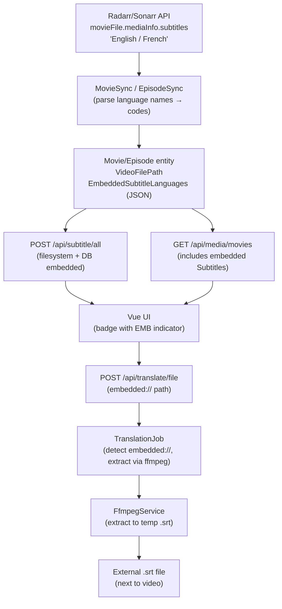

# Embedded Subtitle Support Plan

## Architecture Overview



## Key Design Decision: Embedded Subtitle Virtual Path

Embedded subtitles are identified by a virtual path format:

```
embedded:///movies/Movie (2023)/Movie (2023).mkv?lang=en
```

This path is stored as `SubtitleToTranslate` in `TranslationRequest` and triggers extraction in `TranslationJob`.

---

## Phase 1 — Radarr/Sonarr Integration DTOs & Sync

**Files:**

- [`Lingarr.Server/Models/Integrations/RadarrMovieFile.cs`](Lingarr.Server/Models/Integrations/RadarrMovieFile.cs) — add `MediaInfo` property
- [`Lingarr.Server/Models/Integrations/SonarrEpisodeFile.cs`](Lingarr.Server/Models/Integrations/SonarrEpisodeFile.cs) — add `MediaInfo` property
- New file: `Lingarr.Server/Models/Integrations/MediaInfo.cs` — `Subtitles` string property

```csharp
// MediaInfo.cs
public class MediaInfo {
    [JsonPropertyName("subtitles")]
    public string Subtitles { get; set; } = string.Empty;
}
```

**`LanguageCodeService`** — add `TryGetCodeFromEnglishName(string name, out string? code)` that searches neutral `CultureInfo` instances by `EnglishName` to convert "English" → "en", "French" → "fr".

**Entities** ([`Lingarr.Core/Entities/Movie.cs`](Lingarr.Core/Entities/Movie.cs), [`Episode.cs`](Lingarr.Core/Entities/Episode.cs)):

- Add `VideoFilePath` (nullable string) — full path to video file
- Add `EmbeddedSubtitleLanguages` (nullable string, stored as JSON) — e.g., `["en","fr"]`

**Sync services:**

- [`MovieSync.cs`](Lingarr.Server/Services/Sync/MovieSync.cs) — set `VideoFilePath = moviePath` and `EmbeddedSubtitleLanguages` from parsed `movie.MovieFile.MediaInfo.Subtitles`
- [`EpisodeSync.cs`](Lingarr.Server/Services/Sync/EpisodeSync.cs) — set same fields from `episodePathResult.EpisodeFile.MediaInfo.Subtitles`

---

## Phase 2 — Database Migration

New file: `Lingarr.Migrations/Migrations/M0012_AddEmbeddedSubtitlesSupport.cs`

```csharp
[Migration(12)]
public class M0012_AddEmbeddedSubtitlesSupport : Migration {
    public override void Up() {
        Alter.Table("movies")
            .AddColumn("video_file_path").AsString().Nullable()
            .AddColumn("embedded_subtitle_languages").AsString().Nullable();
        Alter.Table("episodes")
            .AddColumn("video_file_path").AsString().Nullable()
            .AddColumn("embedded_subtitle_languages").AsString().Nullable();
    }
    ...
}
```

Also update `LingarrDbContext` EF configuration to use a JSON value converter for `EmbeddedSubtitleLanguages`.

---

## Phase 3 — Expose Embedded Subtitles in API

**[`Subtitles.cs`](Lingarr.Server/Models/FileSystem/Subtitles.cs)** — add `bool IsEmbedded` property.

**[`SubtitleController.cs`](Lingarr.Server/Controllers/SubtitleController.cs)** — inject `LingarrDbContext`; after filesystem scan, query episodes/movies with matching `Path` and append embedded subtitle entries (using the `embedded://` virtual path).

**[`MediaService.cs`](Lingarr.Server/Services/MediaService.cs)** — in `GetMovies`, after `GetAllSubtitles(movie.Path)`, also build embedded `Subtitles` entries from `movie.EmbeddedSubtitleLanguages` + `movie.VideoFilePath` and merge into the list.

---

## Phase 4 — ffmpeg Extraction Service

**New `Lingarr.Server/Interfaces/Services/IFfmpegService.cs`:**

```csharp
Task<string> ExtractSubtitleAsync(string videoFilePath, string languageCode, string tempOutputPath);
bool IsAvailable();
```

**New `Lingarr.Server/Services/FfmpegService.cs`:**

- Converts 2-letter ISO code → 3-letter (`CultureInfo.ThreeLetterISOLanguageName`) for ffmpeg's `-map 0:s:m:language:<code>` filter
- Runs `ffmpeg -i <video> -map 0:s:m:language:<3code> -c:s srt <tempPath> -y`
- Registered as scoped/singleton in DI

**[`Lingarr.Server/Dockerfile`](Lingarr.Server/Dockerfile)** — install ffmpeg in the `base` stage:

```dockerfile
FROM mcr.microsoft.com/dotnet/aspnet:10.0 AS base
RUN apt-get update && apt-get install -y ffmpeg --no-install-recommends && rm -rf /var/lib/apt/lists/*
```

---

## Phase 5 — Translation Pipeline (TranslationJob)

**[`SubtitleService.CreateFilePath`](Lingarr.Server/Services/SubtitleService.cs)** — detect `embedded://` scheme; parse video path + `lang` query param, then produce output as `<videoDir>/<videoStem>.<targetLang>.srt`.

**[`TranslationJob.cs`](Lingarr.Server/Jobs/TranslationJob.cs)** — in `Execute`, before `ReadSubtitles`:

1. If `SubtitleToTranslate` starts with `embedded://`, call `IFfmpegService.ExtractSubtitleAsync` → temp file path
2. Use temp file for `ValidateSubtitle` and `ReadSubtitles`
3. In `WriteSubtitles`, pass original embedded path (not temp) to `CreateFilePath` for correct output naming
4. In `finally` block, delete temp file if it exists (covers both success and failure paths)

---

## Phase 6 — Frontend

**[`Lingarr.Client/src/ts/subtitle.ts`](Lingarr.Client/src/ts/subtitle.ts):**

```typescript
export interface ISubtitle {
  path: string;
  language: string;
  fileName: string;
  format: string;
  caption: string;
  isEmbedded: boolean;
}
```

**[`EpisodeTable.vue`](Lingarr.Client/src/components/features/show/EpisodeTable.vue)** and **[`MoviePage.vue`](Lingarr.Client/src/pages/MoviePage.vue)** — add a visual indicator on the badge when `subtitle.isEmbedded` is true (e.g., lighter badge with "EMB" suffix or a distinct border color).

---

## Notes & Constraints

- **Re-sync required**: Embedded subtitle data is only populated on next Radarr/Sonarr sync; existing DB records get `NULL` until then.
- **Text-only extraction**: ffmpeg can only extract text-based tracks (SRT, ASS, SSA). Image-based tracks (PGS, VOBSUB) will fail; `TranslationJob` logs a warning and marks the request as Failed — no silent data loss.
- **Language name mapping**: Radarr/Sonarr return "English" (not "en"); `LanguageCodeService` will be extended to resolve via `CultureInfo.EnglishName` on neutral cultures.
- **ffmpeg selection**: Uses language metadata tag (`-map 0:s:m:language:eng`). If multiple tracks share the same language, the first is selected. Stream-index-level granularity is not available from the Radarr/Sonarr API alone.
